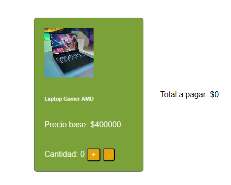

# Calculadora-de-productos-gamer

Consiste en una tarjeta de producto interactiva que permite agregar o restar unidades y calcular el total a pagar en tiempo real.

## Demo

[Ver proyecto en vivo](https://camlo77.github.io/Calculadora-de-productos/)

## Tecnologías

- HTML5
- CSS3
- JavaScript vanilla

## Funcionalidades

- Visualización del precio base de un producto
- Botones para incrementar y decrementar la cantidad
- Cálculo automático del total según la cantidad seleccionada
- La cantidad no puede bajar de cero